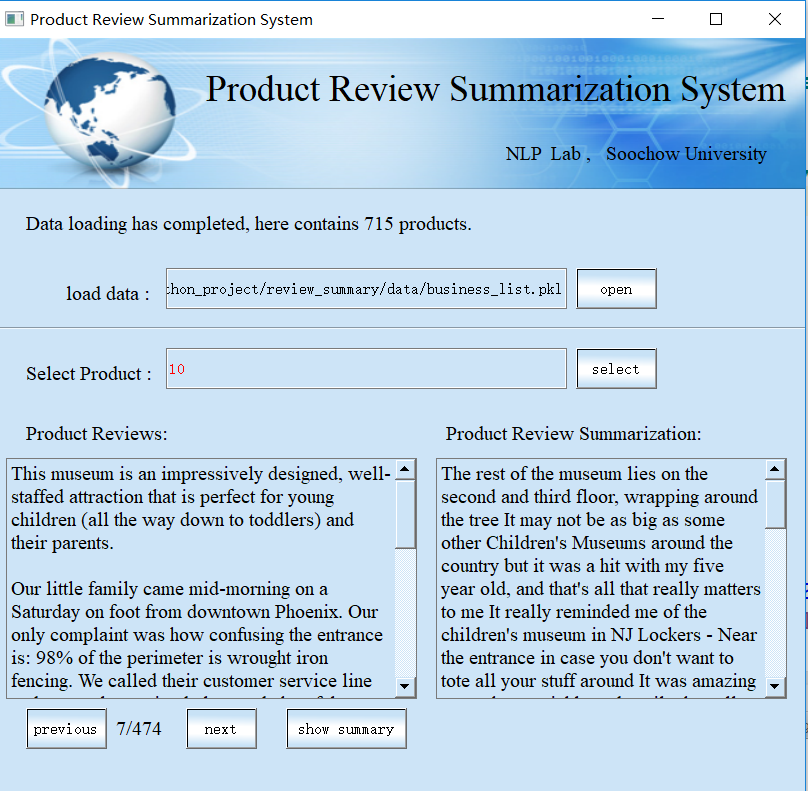
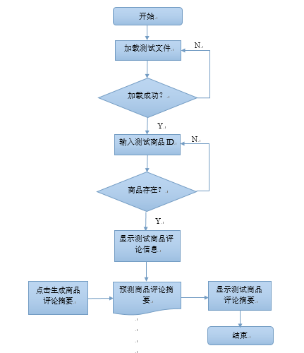

# REVIEW SUMMARIZATION
基于SVM的商品评论摘要系统V1.0
## 软件简介
随着电子商务的发展，一件热门商品常常拥有成百上千条评论，对于即将进行网上购物的用户来说，以人工分析的方式从大量评论中获取商品各个方面的综合评价变得十分困难。评论文摘可以为潜在用户提供大众对某些产品的总体评价情况，使用户摆脱枯燥、繁琐的信息检索和浏览工作，从而为用户的决策提供可靠的依据。本系统采用SVM方法为产品生成评论摘要。用户可以在该工具中进行如下操作：
- 加载产品数据  
- 查看产品的评论内容  
- 利用基于SVM的商品评论摘要系统为指定产品数据生成评论摘要
## 主界面  
  

## 流程图
